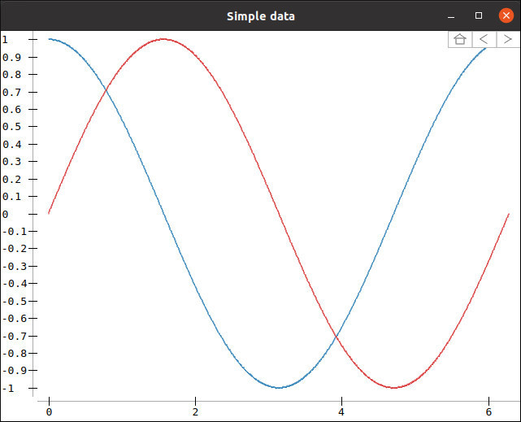

## sanji
### Description
sanji is C++ library heavily inspired by [Matplotlib](https://matplotlib.org/). It was originally created out of the need to create quiver plots with an arrow size given in data units rather than pixel units. The number of features is still very limited, but will hopefully grow over time.

### Examples
#### Sinusoidal data

  

The plot above shows a simple line plot of sinusoidal data. The example code can be found in `examples/SimpleLinePlot.cpp`.

#### Heat quiver data

  

The plot above shows a mix between a quiver plot and a heat map. The example code can be found in `examples/HeatQuiver.cpp`.

### Dependencies
sanji has a number of dependencies, which are listed below
- Qt5 or Qt6
- Eigen >=3.3
- Catch2

### 3rd party licensing
#### Qt
sanji uses Qt under the LGPLv3 license. See https://www.qt.io/ or contact felix.crazzolara[at]gmail.com for information on how to obtain a copy of the Qt source code.

#### Eigen
sanji uses the MPL 2.0-licensed features of Eigen, a C++ template library for linear algebra. The source code of the Eigen library can be obtained at https://eigen.tuxfamily.org/.
